# AWS Bedrock Multi-Tenant Routing

> Inside the [Cloud Systems Engineering](../../README.md) portfolio · *Cloud platforms engineered for scale, reliability, and uptime.*

## Overview

In this build, I created a config-driven AWS Bedrock routing substrate. The system gives applications one endpoint while allowing the routed model to change through configuration instead of code.

The first incident pattern it prevents is hard-coded model ID churn. When model versions change, teams should not have to edit application code, redeploy handlers, or risk stale model references across tenant paths.

The second incident pattern it prevents is an uncontained throttle event. The substrate uses routing, fallback, and circuit breaker behavior so one degraded model path does not spread across the whole platform.

The architecture is built across **7 phases**, anchored by **The Architecture Challenge: One Endpoint for Any Model** on the input side and **Intelligent Prompt Routing to Reduce Spend** at the end. Each phase is listed in the Implementation section below.

## Architecture

```mermaid
---
title: AWS Bedrock Multi-Tenant Routing Substrate
---
%%{init: {"theme":"base","themeVariables": {"primaryColor":"#1B4332","primaryTextColor":"#F4D03F","primaryBorderColor":"#F4D03F","secondaryColor":"#264653","tertiaryColor":"#2F5233","lineColor":"#F4D03F","fontFamily":"ui-monospace, SFMono-Regular, Menlo, Consolas, monospace","fontSize":"13px"}}}%%
flowchart TD
    classDef datastore fill:#264653,stroke:#F4D03F,stroke-width:2px,color:#FFFFFF
    classDef service fill:#1B4332,stroke:#F4D03F,stroke-width:2px,color:#F4D03F
    classDef event fill:#7B42BC,stroke:#F4D03F,stroke-width:2px,color:#FFFFFF
    classDef io fill:#0d1117,stroke:#F4D03F,stroke-width:1.5px,color:#F4D03F,font-style:italic

    Callers[/Callers: One Endpoint, Any Model/]
    Segments[/Tenant Segments: Hospitality, Retail, Healthcare/]
    Operator[/Operator: Change Config, Not Code/]
    ModelChurn[/Model Churn: Versions Change Over Time/]

    subgraph Preflight["Preflight: Prove Access Before Building"]
        IAMCheck(Verify AWS Permissions)
        ModelAccess(Verify Bedrock Model Access)
        TFScaffold[(Terraform Project Scaffold)]
        NovaMicro(amazon.nova-micro-v1:0: Fast, Low-Cost Primary)
        NovaLite(amazon.nova-lite-v1:0: Stronger Failover)
    end

    subgraph IaC["Terraform: Declared Infrastructure"]
        TFProvision(Terraform Provisioning)
        RegionPin(Region Pinning Through IaC)
    end

    subgraph RoutingCore["Routing Core: One Endpoint, Config-Driven"]
        APIGW(API Gateway: Single Entry)
        Handler(Lambda handler.py: Routing Logic)
        Converse(Bedrock Converse API: Common Interface)
        TraceId(Return modelId Beside Response Text)
    end

    subgraph ConfigPlane["AppConfig: Model Choice Out of Code"]
        AppConfig[(AppConfig: Model Routing Rules)]
        SegmentRules[(Per-Segment Active Model)]
        ZeroCodeSwap{{Zero-Code Swap: No Lambda Redeploy}}
    end

    subgraph CostLayer["Per-Segment Cost Attribution"]
        InferProfiles(Application Inference Profiles)
        Tags[(Tags: Segment, CostCenter, Environment)]
        CostExplorer[(Cost Explorer + Cost and Usage Report)]
        LogJoinRejected{{Rejected: Best-Effort Log Reconciliation}}
    end

    subgraph Compliance["HIPAA Region Pinning"]
        HealthcarePin(Healthcare Pinned to us-east-1)
        CloudTrail[(CloudTrail: Converse Events)]
        AuditScript(audit-region.sh: Region Eligibility)
        AuditGate{{PASS: Zero HIPAA Region Violations}}
    end

    subgraph Registry["Model Lifecycle: SageMaker Registry"]
        ModelRegistry[(SageMaker Model Registry)]
        ThreeVersions[(Three Versioned Models)]
        WarmEndpoint(Warm Real-Time Endpoint)
    end

    subgraph Breaker["Circuit Breaker: Blast Radius Containment"]
        StepFn(Step Functions Express: Orchestration)
        CircuitTable[(DynamoDB: Circuit State by Segment)]
        CheckCircuit{{Check Circuit Before Invoke}}
        OpenCircuit{{Open Circuit: Primary Failed After Retries}}
        TTLRecovery{{TTL 30s: Circuit Clears, Retry Primary}}
        FallbackCall(Fallback Model Call: HTTP 200 + fallback true)
    end

    subgraph Observe["Observability"]
        CloudWatch[(CloudWatch: Metrics + Logs)]
        EventBridge(EventBridge: Throttle Events)
    end

    subgraph Validation["Validation: Four Bars"]
        SwapBar{{Swap: Hospitality to nova-lite, No Code Change}}
        ResilienceBar{{Resilience: Retail Fallback in 1.28s}}
        ComplianceBar{{Compliance: Healthcare Stayed us-east-1}}
        LatencyBar{{Latency: 40 Requests, p95 868.72 ms vs 3000 ms}}
    end

    subgraph SecretMission["Secret Mission: Intelligent Prompt Routing"]
        PromptRouter(Bedrock Intelligent Prompt Routing)
        SimplePrompt(Simple Prompts: Route to Cheaper Model)
        ComplexPrompt(Complex Prompts: Hold Quality on Stronger Model)
        RouteCost[(Charge: $1 per 1,000 Invokes, ~30% Token Savings)]
    end

    subgraph Docs["Documentation Artifacts"]
        TechGuide[(Technical Guide: How the Substrate Works)]
        ArchDiagram[(Architecture Diagram: Request + Control Paths)]
        ReviewDeck[(Leadership Review Deck)]
    end

    Response[/Response: Answer + modelId + fallback Flag/]

    IAMCheck --> ModelAccess
    ModelAccess -- "confirmed" --> NovaMicro
    ModelAccess -- "confirmed" --> NovaLite
    ModelAccess --> TFScaffold
    TFScaffold --> TFProvision
    TFProvision --> RegionPin
    TFProvision -. "declares" .-> APIGW
    TFProvision -. "declares" .-> CircuitTable

    Callers --> APIGW
    Segments -. "segment header" .-> APIGW
    APIGW --> StepFn
    StepFn --> CheckCircuit
    CheckCircuit -- "closed" --> Handler
    Handler --> Converse
    Converse -- "primary invoke" --> NovaMicro
    Handler --> TraceId

    Operator -- "edit routing rules" --> AppConfig
    ModelChurn -. "no code edit needed" .-> AppConfig
    AppConfig --> SegmentRules
    SegmentRules -- "active model per segment" --> Handler
    SegmentRules --> ZeroCodeSwap
    TraceId -. "proves config drove the route" .-> ZeroCodeSwap

    Handler --> InferProfiles
    InferProfiles --> Tags
    Tags -- "flow into billing path" --> CostExplorer
    LogJoinRejected -. "attribution must come from billing, not logs" .-> InferProfiles

    SegmentRules -- "healthcare route" --> HealthcarePin
    HealthcarePin --> RegionPin
    Converse -. "emits events" .-> CloudTrail
    CloudTrail --> AuditScript
    AuditScript --> AuditGate

    ModelRegistry --> ThreeVersions
    ThreeVersions --> WarmEndpoint
    WarmEndpoint -. "future lifecycle control" .-> SegmentRules

    Converse -- "throttle or failure" --> EventBridge
    EventBridge --> OpenCircuit
    OpenCircuit -- "write open row" --> CircuitTable
    CircuitTable --> CheckCircuit
    OpenCircuit --> FallbackCall
    FallbackCall --> NovaLite
    CircuitTable --> TTLRecovery
    TTLRecovery -. "next request tries primary" .-> CheckCircuit
    StepFn -. "metrics" .-> CloudWatch
    Handler -. "metrics" .-> CloudWatch

    ZeroCodeSwap --> SwapBar
    FallbackCall --> ResilienceBar
    AuditGate --> ComplianceBar
    APIGW --> LatencyBar

    PromptRouter --> SimplePrompt
    PromptRouter --> ComplexPrompt
    SimplePrompt --> RouteCost
    ComplexPrompt -. "quality held" .-> NovaLite
    Handler -. "predicted quality close enough" .-> PromptRouter

    SwapBar --> TechGuide
    ResilienceBar --> ArchDiagram
    ComplianceBar --> ReviewDeck
    LatencyBar --> ReviewDeck

    Converse --> Response
    FallbackCall --> Response
    Response --> Callers

    class TFScaffold,AppConfig,SegmentRules,Tags,CostExplorer,CloudTrail,CircuitTable,CloudWatch,ModelRegistry,ThreeVersions,RouteCost,TechGuide,ArchDiagram,ReviewDeck datastore
    class IAMCheck,ModelAccess,NovaMicro,NovaLite,TFProvision,RegionPin,APIGW,Handler,Converse,TraceId,InferProfiles,HealthcarePin,AuditScript,WarmEndpoint,StepFn,FallbackCall,EventBridge,PromptRouter,SimplePrompt,ComplexPrompt service
    class ZeroCodeSwap,LogJoinRejected,AuditGate,CheckCircuit,OpenCircuit,TTLRecovery,SwapBar,ResilienceBar,ComplianceBar,LatencyBar event
    class Callers,Segments,Operator,ModelChurn,Response io
```

The diagram shows the topology and data flow of the system as built. The full architectural narrative, with screenshots and prose, lives in [`documents/aws-bedrock-multi-tenant-routing.md`](./documents/aws-bedrock-multi-tenant-routing.md).

## Implementation

This system is built across **7 phases**:

1. **The Architecture Challenge: One Endpoint for Any Model**
2. **Environment Setup and Preflight Verification**
3. **Building the Routing Core with Converse API and AppConfig**
4. **Per-Segment Cost Attribution, HIPAA Region Pinning, and Model Registry**
5. **Circuit Breaker, Blast Radius Containment, and Observability**
6. **End-to-End Validation and Documentation Artifacts**
7. **Intelligent Prompt Routing to Reduce Spend**

For the full walkthrough with screenshots and step-by-step content, see [`documents/aws-bedrock-multi-tenant-routing.md`](./documents/aws-bedrock-multi-tenant-routing.md).

## Validation

Each build phase below is documented in [`documents/aws-bedrock-multi-tenant-routing.md`](./documents/aws-bedrock-multi-tenant-routing.md), with screenshots, configuration, and notes as captured during the build:

- ✅ The Architecture Challenge: One Endpoint for Any Model
- ✅ Environment Setup and Preflight Verification
- ✅ Building the Routing Core with Converse API and AppConfig
- ✅ Per-Segment Cost Attribution, HIPAA Region Pinning, and Model Registry
- ✅ Circuit Breaker, Blast Radius Containment, and Observability
- ✅ End-to-End Validation and Documentation Artifacts
- ✅ Intelligent Prompt Routing to Reduce Spend
