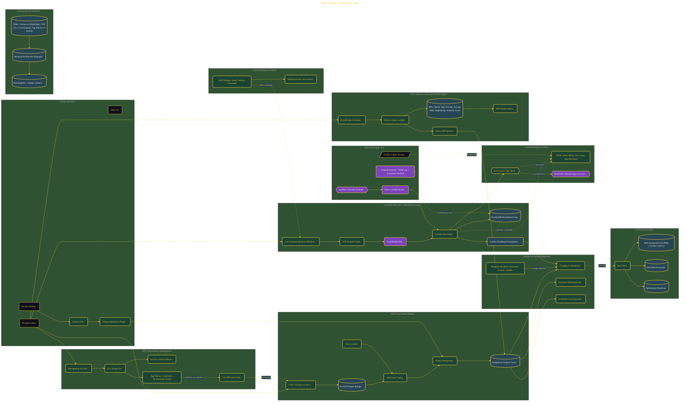

# AWS FinOps Command Center

> Inside the [Cloud Systems Engineering](../../README.md) portfolio · *Cloud platforms engineered for scale, reliability, and uptime.*

## Overview

In this project, I built an enterprise FinOps command center designed to improve cloud cost visibility, automate governance actions, and provide leadership-ready financial reporting for a Fortune 10 scale environment.

The architecture combined CUR 2.0 exports, Glue, Athena, Grafana, Cost Anomaly Detection, Lambda remediation workflows, Budget Actions, Organizations Tag Policies, and executive dashboards into a unified FinOps operating model. The objective was to move from reactive billing analysis toward automated cost intelligence and operational governance.

The architecture is built across **9 phases**, anchored by **Building an Enterprise FinOps Command Center** on the input side and **Carbon Footprint Overlay and Automated Weekly FinOps Cadence** at the end. Each phase is listed in the Implementation section below.

## Architecture

The diagram shows the topology and data flow of the system as built. The full architectural narrative, with screenshots and prose, lives in [`documents/aws-finops-command-center.md`](./documents/aws-finops-command-center.md).

## Implementation

This system is built across **9 phases**:

1. **Building an Enterprise FinOps Command Center**
2. **Setting Up the FinOps Toolchain**
3. **Architecting with Pre-Artifacts: ADRs, Diagrams, and Governance Plans**
4. **Deploying the CUR 2.0 → Glue → Athena Data Pipeline**
5. **Building the Grafana Executive Dashboard**
6. **Automating Anomaly Detection and Remediation**
7. **Validating the End-to-End Pipeline with a Spike Test**
8. **Delivering the CFO Executive Pitch Deck**
9. **Carbon Footprint Overlay and Automated Weekly FinOps Cadence**

For the full walkthrough with screenshots and step-by-step content, see [`documents/aws-finops-command-center.md`](./documents/aws-finops-command-center.md).

## Validation

Build outcomes verified end-to-end. Each phase below is captured with screenshots, configuration, and observable behavior in [`documents/aws-finops-command-center.md`](./documents/aws-finops-command-center.md):

- ✅ Building an Enterprise FinOps Command Center
- ✅ Setting Up the FinOps Toolchain
- ✅ Architecting with Pre-Artifacts: ADRs, Diagrams, and Governance Plans
- ✅ Deploying the CUR 2.0 → Glue → Athena Data Pipeline
- ✅ Building the Grafana Executive Dashboard
- ✅ Automating Anomaly Detection and Remediation
- ✅ Validating the End-to-End Pipeline with a Spike Test
- ✅ Delivering the CFO Executive Pitch Deck
- ✅ Carbon Footprint Overlay and Automated Weekly FinOps Cadence
