# AWS Hybrid Cloud Network Architecture

> Inside the [Cloud Systems Engineering](../../README.md) portfolio · *Cloud platforms engineered for scale, reliability, and uptime.*

## Overview

In this project, I built a production-grade AWS hybrid cloud network architecture designed for a Fortune 500 media organization supporting hundreds of engineering teams across multiple AWS accounts and on-premises datacenters.

The objective was to design a scalable, segmented, and secure hybrid networking model using Terraform and AWS-native networking services. The architecture combined Transit Gateway hub-spoke routing, hybrid VPN connectivity with BGP, centralized inspection through AWS Network Firewall, Route 53 hybrid DNS, PrivateLink connectivity, and compliance validation into a unified enterprise networking design.

The architecture is built across **9 phases**, anchored by **Building a Fortune 500 Network Reference Architecture** on the input side and **VPN Failover Drill: Proving BGP Reconvergence Under 60 Seconds** at the end. Each phase is listed in the Implementation section below.

## Architecture

```mermaid
---
title: AWS Hybrid Cloud Network Architecture
---
%%{init: {"theme":"base","themeVariables": {"primaryColor":"#1B4332","primaryTextColor":"#F4D03F","primaryBorderColor":"#F4D03F","secondaryColor":"#264653","tertiaryColor":"#2F5233","lineColor":"#F4D03F","fontFamily":"ui-monospace, SFMono-Regular, Menlo, Consolas, monospace","fontSize":"13px"}}}%%
flowchart LR
    classDef datastore fill:#264653,stroke:#F4D03F,stroke-width:2px,color:#FFFFFF
    classDef service fill:#1B4332,stroke:#F4D03F,stroke-width:2px,color:#F4D03F
    classDef event fill:#7B42BC,stroke:#F4D03F,stroke-width:2px,color:#FFFFFF
    classDef io fill:#0d1117,stroke:#F4D03F,stroke-width:1.5px,color:#F4D03F,font-style:italic

    subgraph IaC["Terraform Multi-Account Scaffold"]
        Terraform(Terraform Root)
        ProviderA(Account A Provider Alias)
        ProviderB(Account B Provider Alias)
        Modules[(Reusable Modules: VPC, TGW, Firewall, VPN, Endpoints, Resolver, PrivateLink, Reachability)]
    end

    subgraph Accounts["AWS Two-Account Landing Zone"]
        NetworkingAcct(Networking Account)
        WorkloadAcct(Workload Account)
        RAM(AWS RAM: TGW Resource Share)
    end

    subgraph Hub["Transit Gateway Hub"]
        TGW(Transit Gateway)
        SpokeRT[(Spoke Route Table)]
        InspectRT[(Inspection Route Table)]
        TGWShare(TGW Attachment Share via RAM)
    end

    subgraph Spokes["Four-VPC Spoke Topology"]
        AppVPC(App VPC)
        SharedVPC(Shared Services VPC)
        InspectVPC(Inspection VPC)
        DMZVPC(DMZ VPC)
    end

    subgraph Hybrid["Hybrid VPN with BGP"]
        OnPrem[("On-Premises Simulated Datacenter")]
        CGW(EC2 Customer Gateway: strongSwan + FRRouting)
        S2SVPN(Site-to-Site VPN: 2 Tunnels)
        BGP(BGP Dynamic Routing: static_routes_only=false)
    end

    subgraph Inspection["Centralized Egress Inspection"]
        NFW(AWS Network Firewall)
        Suricata(Suricata Stateful Rules)
        BlockList[(Known-Malicious Domains)]
        Egress(Centralized Internet Egress)
    end

    subgraph PrivateConn["NAT-Free Private Connectivity"]
        S3GW(S3 Gateway Endpoint)
        DDBGW(DynamoDB Gateway Endpoint)
        IntNLB(Internal Network Load Balancer)
        PLProducer(PrivateLink Producer Service)
        PLConsumer(PrivateLink Consumer Endpoint)
    end

    subgraph DNS["Bidirectional Hybrid DNS"]
        R53Inbound(Route 53 Resolver Inbound Endpoint)
        R53Outbound(Route 53 Resolver Outbound Endpoint)
        OnPremDNS[("On-Premises DNS Server")]
        PrivateZone[(AWS Private Hosted Zone)]
    end

    subgraph Validation["Compliance and Path Validation"]
        ReachAnalyzer(Reachability Analyzer)
        ENICheck{{ENI_SG_RULES_MISMATCH Detection}}
        DataPlane(Live Data-Plane Tests)
        FailoverDrill{{VPN Failover Drill: 38s BGP Reconvergence}}
    end

    Terraform --> ProviderA
    Terraform --> ProviderB
    Terraform --> Modules
    ProviderA --> NetworkingAcct
    ProviderB --> WorkloadAcct
    Modules -.deploy.-> TGW
    Modules -.deploy.-> NFW
    Modules -.deploy.-> S2SVPN

    NetworkingAcct --> RAM
    RAM --> TGWShare
    TGWShare -.shares.-> WorkloadAcct
    WorkloadAcct -.attaches.-> TGW

    TGW --> SpokeRT
    TGW --> InspectRT
    SpokeRT -.routes spoke traffic.-> InspectVPC
    InspectRT -.routes inspection return paths.-> Spokes
    AppVPC --> TGW
    SharedVPC --> TGW
    InspectVPC --> TGW
    DMZVPC --> TGW

    OnPrem --> CGW
    CGW --> S2SVPN
    S2SVPN --> BGP
    BGP --> TGW

    InspectVPC --> NFW
    NFW --> Suricata
    Suricata --> BlockList
    NFW --> Egress
    SpokeRT -.force outbound through.-> NFW

    AppVPC --> S3GW
    AppVPC --> DDBGW
    SharedVPC --> PLProducer
    PLProducer --> IntNLB
    AppVPC --> PLConsumer
    PLConsumer -.private.-> PLProducer

    OnPremDNS --> R53Inbound
    R53Inbound --> PrivateZone
    AppVPC --> R53Outbound
    R53Outbound -.forwards to.-> OnPremDNS

    ReachAnalyzer --> ENICheck
    ReachAnalyzer -.control-plane evaluation.-> Spokes
    DataPlane -.live packets.-> Suricata
    DataPlane -.live packets.-> S3GW
    DataPlane -.live packets.-> PLConsumer
    FailoverDrill -.ipsec auto --down tunnel1.-> S2SVPN
    FailoverDrill -.measures.-> BGP
    class Terraform,ProviderA,ProviderB io
    class NetworkingAcct,WorkloadAcct,RAM,TGW,TGWShare,AppVPC,SharedVPC,InspectVPC,DMZVPC service
    class CGW,S2SVPN,BGP,NFW,Suricata,Egress,S3GW,DDBGW,IntNLB,PLProducer,PLConsumer service
    class R53Inbound,R53Outbound,ReachAnalyzer,DataPlane service
    class Modules,SpokeRT,InspectRT,BlockList,PrivateZone datastore
    class OnPrem,OnPremDNS io
    class ENICheck,FailoverDrill event
```

The diagram shows the topology and data flow of the system as built. The full architectural narrative, with screenshots and prose, lives in [`documents/aws-hybrid-cloud-network-architecture.md`](./documents/aws-hybrid-cloud-network-architecture.md).

## Implementation

This system is built across **9 phases**:

1. **Building a Fortune 500 Network Reference Architecture**
2. **Scaffolding the Multi-Account Terraform Environment**
3. **Deploying the Transit Gateway Hub-Spoke Network**
4. **Establishing Hybrid Connectivity via Site-to-Site VPN with BGP**
5. **Centralizing Egress Inspection with AWS Network Firewall**
6. **Eliminating NAT Costs with Gateway Endpoints and PrivateLink**
7. **Cross-Account Governance and Bidirectional Hybrid DNS**
8. **Proving Compliance with Reachability Analyzer and Data-Plane Tests**
9. **VPN Failover Drill: Proving BGP Reconvergence Under 60 Seconds**

For the full walkthrough with screenshots and step-by-step content, see [`documents/aws-hybrid-cloud-network-architecture.md`](./documents/aws-hybrid-cloud-network-architecture.md).

## Validation

Each build phase below is documented in [`documents/aws-hybrid-cloud-network-architecture.md`](./documents/aws-hybrid-cloud-network-architecture.md), with screenshots, configuration, and notes as captured during the build:

- ✅ Building a Fortune 500 Network Reference Architecture
- ✅ Scaffolding the Multi-Account Terraform Environment
- ✅ Deploying the Transit Gateway Hub-Spoke Network
- ✅ Establishing Hybrid Connectivity via Site-to-Site VPN with BGP
- ✅ Centralizing Egress Inspection with AWS Network Firewall
- ✅ Eliminating NAT Costs with Gateway Endpoints and PrivateLink
- ✅ Cross-Account Governance and Bidirectional Hybrid DNS
- ✅ Proving Compliance with Reachability Analyzer and Data-Plane Tests
- ✅ VPN Failover Drill: Proving BGP Reconvergence Under 60 Seconds
