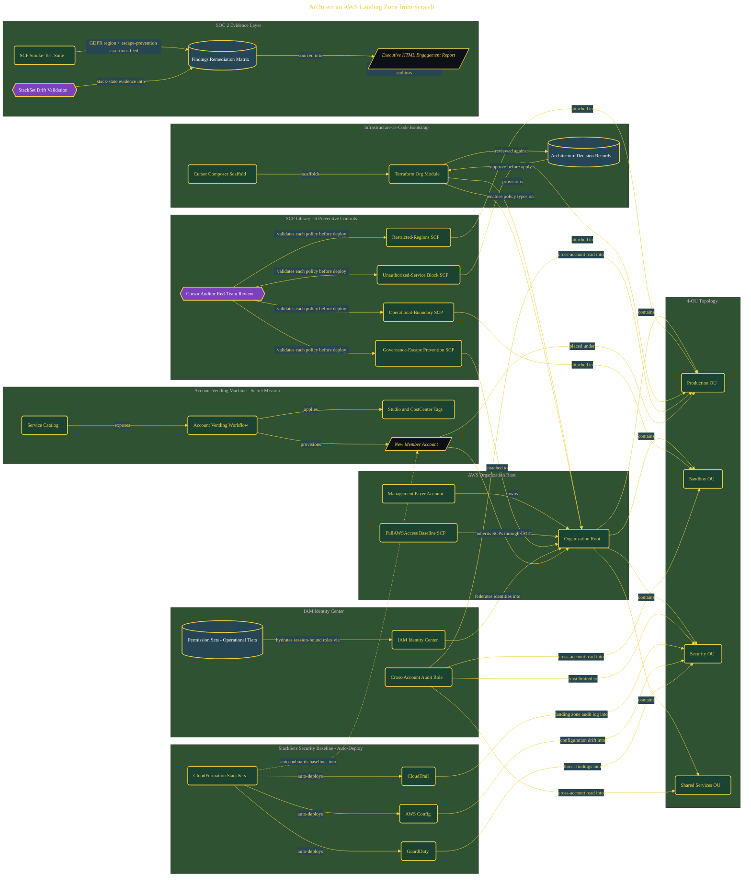

# Architect an AWS Landing Zone from Scratch

> Inside the [Cloud Systems Engineering](../../README.md) portfolio · *Cloud platforms engineered for scale, reliability, and uptime.*

## Overview

In this project, I built a production-style AWS landing zone designed to support a rapidly growing gaming company operating under SOC 2 compliance requirements. The objective was to establish a scalable multi-account governance model that could standardize security controls, automate account onboarding, and reduce operational drift as new business units and acquisitions were integrated into the environment.

The architecture combined AWS Organizations, Terraform, Service Control Policies, StackSets, IAM Identity Center, and Service Catalog into a centralized governance framework. Instead of treating cloud accounts as isolated deployments, the environment was designed as a governed operating platform where security, monitoring, and compliance controls inherit automatically through organizational structure.

The architecture is built across **10 phases**, anchored by **Architecting NovaBurst's Governance Foundation** on the input side and **Scaling Governance for the Next Acquisition** at the end. Each phase is listed in the Implementation section below.

## Architecture

The diagram shows the topology and data flow of the system as built. The full architectural narrative, with screenshots and prose, lives in [`documents/aws-landing-zone-soc2-governance.md`](./documents/aws-landing-zone-soc2-governance.md).

## Implementation

This system is built across **10 phases**:

1. **Architecting NovaBurst's Governance Foundation**
2. **Environment Setup and Terraform Initialization**
3. **Designing the Multi-Account OU Topology**
4. **Bootstrapping the AWS Organization with Terraform**
5. **Building the SCP Library to Close Every Auditor Finding**
6. **Deploying the StackSets Security Baseline**
7. **Centralizing Identity Governance with IAM Identity Center**
8. **Proving Compliance: SCP Smoke Tests and Operational Artifacts**
9. **Delivering the Principal Architect's Engagement Report**
10. **Scaling Governance for the Next Acquisition**

For the full walkthrough with screenshots and step-by-step content, see [`documents/aws-landing-zone-soc2-governance.md`](./documents/aws-landing-zone-soc2-governance.md).

## Validation

Each build phase below is documented in [`documents/aws-landing-zone-soc2-governance.md`](./documents/aws-landing-zone-soc2-governance.md), with screenshots, configuration, and notes as captured during the build:

- ✅ Architecting NovaBurst's Governance Foundation
- ✅ Environment Setup and Terraform Initialization
- ✅ Designing the Multi-Account OU Topology
- ✅ Bootstrapping the AWS Organization with Terraform
- ✅ Building the SCP Library to Close Every Auditor Finding
- ✅ Deploying the StackSets Security Baseline
- ✅ Centralizing Identity Governance with IAM Identity Center
- ✅ Proving Compliance: SCP Smoke Tests and Operational Artifacts
- ✅ Delivering the Principal Architect's Engagement Report
- ✅ Scaling Governance for the Next Acquisition
