# ECS vs EKS vs Lambda Architecture

> Inside the [Cloud Systems Engineering](../../README.md) portfolio · *Cloud platforms engineered for scale, reliability, and uptime.*

## Overview

This project focused on evaluating three AWS compute models for a payment-processing platform while maintaining security, resiliency, and deployment agility. The objective was to compare ECS on EC2, ECS on Fargate, and EKS against a serverless event-driven architecture to determine which approach best aligned with Meridian Payments' operational and compliance requirements.

The engagement also introduced a multi-agent development workflow using Cursor Composer agents, allowing infrastructure, deployment automation, testing, architecture planning, and documentation activities to progress in parallel. The outcome was a complete environment capable of demonstrating deployment patterns, security controls, workload resiliency, and architectural tradeoffs across multiple AWS services.

The architecture is built across **9 phases**, anchored by **Architecting Under Pressure: The Meridian Payments Mission** on the input side and **Service Connect, EventBridge Pipes, and Phase 2 Positioning** at the end. Each phase is listed in the Implementation section below.

## Architecture

```mermaid
---
title: Meridian Payments AWS Multi-Compute Platform with PCI-DSS Scan Gate
---
%%{init: {"theme":"base","themeVariables": {"primaryColor":"#1B4332","primaryTextColor":"#F4D03F","primaryBorderColor":"#F4D03F","secondaryColor":"#264653","tertiaryColor":"#2F5233","lineColor":"#F4D03F","fontFamily":"ui-monospace, SFMono-Regular, Menlo, Consolas, monospace","fontSize":"13px"}}}%%
flowchart LR
    classDef datastore fill:#264653,stroke:#F4D03F,stroke-width:2px,color:#FFFFFF
    classDef service fill:#1B4332,stroke:#F4D03F,stroke-width:2px,color:#F4D03F
    classDef event fill:#7B42BC,stroke:#F4D03F,stroke-width:2px,color:#FFFFFF
    classDef io fill:#0d1117,stroke:#F4D03F,stroke-width:1.5px,color:#F4D03F,font-style:italic

    Architect[/"Architect (operator)"/]
    PaymentEvent[/"Payment / webhook event"/]
    CISO[/"CISO + Board"/]

    subgraph Toolchain["Verified Local Toolchain"]
        Terraform("Terraform")
        AWSCLI("AWS CLI")
        Docker("Docker Desktop")
        K6("Grafana k6 (installed for perf)")
        CursorIDE("Cursor IDE")
    end

    subgraph FiveAgentTeam["5-Agent Cursor Composer Strike Team"]
        Foundation("Foundation: Terraform + ECR + networking")
        Pipeline("Pipeline: CodeDeploy + release controls")
        Backbone("Backbone: serverless event processing")
        Breaker("Breaker: testing + chaos + DLQ validation")
        Narrator("Narrator: ADRs + FinOps + 8-slide briefing")
    end

    subgraph SupplyChain["Container Supply Chain"]
        FlaskApp("Python Flask app")
        DockerBuild("Docker build")
        ECR[(Amazon ECR with scan-on-push)]
        ScanGate{{"scan-gate.sh: block on CRITICAL findings"}}
        LifecyclePolicy[(ECR lifecycle: retain recent only)]
    end

    subgraph SharedNetwork["Shared VPC + ALB"]
        VPC("Shared VPC")
        ALB("Application Load Balancer")
        WeightedTGs("Weighted target groups")
        PrivateSubnets("Private subnets")
    end

    subgraph ThreeComputePaths["3 Container Compute Paths"]
        ECSEC2("ECS on EC2: max host control")
        ECSFargate("ECS on Fargate: managed compute")
        EKS("EKS: Kubernetes orchestration")
        AWSVPCMode{{"awsvpc networking: task-level ENI isolation"}}
    end

    subgraph BlueGreenPipeline["Zero-Downtime Blue/Green Pipeline"]
        CodeDeploy("AWS CodeDeploy")
        Canary10Pct{{"ECSCanary10Percent5Minutes traffic shift"}}
        BlueTaskSet("Blue task set")
        GreenTaskSet("Green task set")
        AutoRollback{{"Auto-rollback on health check failure"}}
    end

    subgraph ServerlessBackbone["Serverless Event-Driven Backbone"]
        APIGateway("API Gateway: public ingestion")
        LambdaIngest("Lambda: accept + publish")
        LambdaAliases("Lambda aliases for weighted routing")
        LambdaSnapStart{{"Lambda SnapStart: lower init latency"}}
        EventBridge("EventBridge")
        StepFunctionsExpress("Step Functions Express: short-lived workflow")
        DynamoDB[(DynamoDB)]
        DLQ[(Dead-letter queue)]
    end

    subgraph ChaosAndPerf["Chaos + Performance Validation"]
        K6Load("k6 load test")
        ChaosDrill("Chaos drill")
        DLQValidation("DLQ validation")
        FargateSelfHeal("Fargate self-heal: failed task auto-replaced")
        SLAEvidence[/"Recovery governed by service definitions, not task health"/]
    end

    subgraph ADRStack["ADRs + Executive Package"]
        ADRs[(Architecture Decision Records)]
        ADR002[(ADR-002: awsvpc for ECS, CISO-targeted)]
        TopologyDiagrams[(Topology diagrams)]
        FinOpsReport[(FinOps cost analysis)]
        EightSlideBriefing[(8-slide executive briefing)]
        DependencyMap[(Five-agent dependency map)]
    end

    subgraph FinalValidation["End-to-End Validation Sweep"]
        DeployNewVersion("Deploy new app version through blue/green")
        VulnerableImage[/"Deliberately vulnerable image"/]
        ScanGateBlock{{"Scan gate correctly blocks vulnerable image"}}
        PCIEvidenceLog[(PCI-DSS audit-trail log)]
    end

    subgraph SecretMission["Secret Mission: EventBridge Pipes"]
        EBPipes("EventBridge Pipes: managed source-to-target")
        EliminatedLambdaGlue{{"Eliminates polling + scaling + retry Lambda glue"}}
        Phase2Positioning[(Phase 2 architectural positioning)]
    end

    Architect --> Toolchain
    Architect --> FiveAgentTeam
    Foundation --> SupplyChain
    Foundation --> SharedNetwork
    Pipeline --> BlueGreenPipeline
    Backbone --> ServerlessBackbone
    Breaker --> ChaosAndPerf
    Narrator --> ADRStack

    FlaskApp --> DockerBuild
    DockerBuild --> ECR
    ECR --> ScanGate
    LifecyclePolicy -.attached to.-> ECR
    ScanGate -.allow.-> ThreeComputePaths
    ScanGate -.allow.-> ServerlessBackbone

    VPC --> ALB
    ALB --> WeightedTGs
    WeightedTGs --> ECSEC2
    WeightedTGs --> ECSFargate
    WeightedTGs --> EKS
    AWSVPCMode -.applied to.-> ECSEC2
    AWSVPCMode -.applied to.-> ECSFargate
    PrivateSubnets -.host.-> ECSEC2
    PrivateSubnets -.host.-> ECSFargate
    PrivateSubnets -.host.-> EKS

    CodeDeploy --> Canary10Pct
    Canary10Pct --> BlueTaskSet
    Canary10Pct --> GreenTaskSet
    Canary10Pct -.metric trigger.-> AutoRollback
    AutoRollback -.return traffic.-> BlueTaskSet

    PaymentEvent --> APIGateway
    APIGateway --> LambdaIngest
    LambdaIngest --> LambdaAliases
    LambdaSnapStart -.warms.-> LambdaIngest
    LambdaIngest --> EventBridge
    EventBridge --> StepFunctionsExpress
    StepFunctionsExpress --> DynamoDB
    StepFunctionsExpress -.malformed.-> DLQ

    K6Load --> ECSFargate
    K6Load --> ServerlessBackbone
    ChaosDrill --> ECSFargate
    ChaosDrill --> FargateSelfHeal
    FargateSelfHeal --> SLAEvidence
    DLQValidation --> DLQ

    ADR002 -.documents.-> AWSVPCMode
    ADRs --> ADR002
    ADRs --> TopologyDiagrams
    ADRs --> FinOpsReport
    ADRs --> EightSlideBriefing
    DependencyMap -.5-agent.-> FiveAgentTeam
    EightSlideBriefing --> CISO

    DeployNewVersion --> BlueGreenPipeline
    VulnerableImage --> ECR
    ECR -.CRITICAL detected.-> ScanGateBlock
    ScanGateBlock --> PCIEvidenceLog

    EBPipes -.replaces.-> EliminatedLambdaGlue
    EBPipes -.consideration for.-> Phase2Positioning
    class Terraform,AWSCLI,Docker,K6,CursorIDE service
    class Foundation,Pipeline,Backbone,Breaker,Narrator service
    class FlaskApp,DockerBuild service
    class VPC,ALB,WeightedTGs,PrivateSubnets,ECSEC2,ECSFargate,EKS service
    class CodeDeploy,BlueTaskSet,GreenTaskSet service
    class APIGateway,LambdaIngest,LambdaAliases,EventBridge,StepFunctionsExpress service
    class K6Load,ChaosDrill,DLQValidation,FargateSelfHeal service
    class DeployNewVersion,EBPipes service
    class ECR,LifecyclePolicy,DynamoDB,DLQ,ADRs,ADR002,TopologyDiagrams,FinOpsReport,EightSlideBriefing,DependencyMap,PCIEvidenceLog,Phase2Positioning datastore
    class ScanGate,AWSVPCMode,Canary10Pct,AutoRollback,LambdaSnapStart,ScanGateBlock,EliminatedLambdaGlue event
    class Architect,PaymentEvent,CISO,SLAEvidence,VulnerableImage io
```

The diagram shows the topology and data flow of the system as built. The full architectural narrative, with screenshots and prose, lives in [`documents/aws-multi-compute-pci-payments-platform.md`](./documents/aws-multi-compute-pci-payments-platform.md).

## Implementation

This system is built across **9 phases**:

1. **Architecting Under Pressure: The Meridian Payments Mission**
2. **Securing the Container Supply Chain with ECR and Scan Gates**
3. **Proving Three Compute Paths on One Workload**
4. **Refactoring the Webhook Dispatcher into a Serverless Event Backbone**
5. **Deploying with Zero-Downtime Blue/Green Pipelines**
6. **Chaos-Testing the Platform and Proving Enterprise SLA**
7. **Delivering the Board Presentation and Leadership Package**
8. **Final Validation: Scan Gate Demo and Real Numbers in the Presentation**
9. **Service Connect, EventBridge Pipes, and Phase 2 Positioning**

For the full walkthrough with screenshots and step-by-step content, see [`documents/aws-multi-compute-pci-payments-platform.md`](./documents/aws-multi-compute-pci-payments-platform.md).

## Validation

Each build phase below is documented in [`documents/aws-multi-compute-pci-payments-platform.md`](./documents/aws-multi-compute-pci-payments-platform.md), with screenshots, configuration, and notes as captured during the build:

- ✅ Architecting Under Pressure: The Meridian Payments Mission
- ✅ Securing the Container Supply Chain with ECR and Scan Gates
- ✅ Proving Three Compute Paths on One Workload
- ✅ Refactoring the Webhook Dispatcher into a Serverless Event Backbone
- ✅ Deploying with Zero-Downtime Blue/Green Pipelines
- ✅ Chaos-Testing the Platform and Proving Enterprise SLA
- ✅ Delivering the Board Presentation and Leadership Package
- ✅ Final Validation: Scan Gate Demo and Real Numbers in the Presentation
- ✅ Service Connect, EventBridge Pipes, and Phase 2 Positioning
