# Get Promoted: Build AWS DR Worth $1M

> Inside the [Cloud Systems Engineering](../../README.md) portfolio · *Cloud platforms engineered for scale, reliability, and uptime.*

## Overview

In this project, I designed a multi-region AWS disaster recovery architecture to protect MegaCart from revenue-impacting outages and reduce the business risk exposed during the previous Black Friday incident, which resulted in approximately $4.7M in losses.

The objective extended beyond technical recovery. The architecture needed to align recovery strategy with revenue impact, customer experience, and executive expectations while maintaining operational and financial efficiency. The final design combined tiered recovery models, workload prioritization, gameday validation, and TOGAF-style executive artifacts into a promotion-level architecture package.

The architecture is built across **7 phases**, anchored by **The $4.7M Problem That Demanded a Solution** on the input side and **Cost-Per-Nine Analysis and Ransomware Protection** at the end. Each phase is listed in the Implementation section below.

## Architecture

```mermaid
---
title: AWS Multi-Region DR with Workload Tiering
---
%%{init: {"theme":"base","themeVariables": {"primaryColor":"#1B4332","primaryTextColor":"#F4D03F","primaryBorderColor":"#F4D03F","secondaryColor":"#264653","tertiaryColor":"#2F5233","lineColor":"#F4D03F","fontFamily":"ui-monospace, SFMono-Regular, Menlo, Consolas, monospace","fontSize":"13px"}}}%%
flowchart LR
    classDef datastore fill:#264653,stroke:#F4D03F,stroke-width:2px,color:#FFFFFF
    classDef service fill:#1B4332,stroke:#F4D03F,stroke-width:2px,color:#F4D03F
    classDef event fill:#7B42BC,stroke:#F4D03F,stroke-width:2px,color:#FFFFFF
    classDef io fill:#0d1117,stroke:#F4D03F,stroke-width:1.5px,color:#F4D03F,font-style:italic

    Principal[/"Principal Engineer (operator)"/]
    BlackFriday[/"$4.7M Black Friday baseline (47-min outage)"/]

    subgraph Toolchain["Local DR Lab"]
        TerraformLocal("Terraform 1.15.x via tflocal")
        LocalStack("LocalStack megacart-lab")
        Docker("Docker Desktop")
        CursorIDE("Cursor IDE: 5 Composer agents")
    end

    subgraph ParallelAgents["Parallel Composer Agents"]
        AgentA("Agent-A: Primary 3-tier stack")
        AgentB("Agent-B: 4 DR workspace modules")
        AgentC("Agent-C: Gameday harness")
        AgentD("Agent-D: TOGAF deliverables")
        AgentE("Agent-E: Cost-per-nine + ransomware drill")
    end

    subgraph PrimaryRegion["Primary Region 3-Tier Stack"]
        AppTier("Application Tier")
        DataTier("Data Tier: Aurora MySQL")
        NetTier("Networking Tier")
        ADRs[(ADRs mapped to SAP-C02 domains)]
        AuroraDecision{{"ADR-04: Aurora vs RDS Multi-AZ (30s vs 60-120s failover)"}}
    end

    subgraph DRTiers["Workload-to-Tier Assignment"]
        Checkout("Checkout: $100K/min")
        Catalog("Catalog: browsing")
        UserProfiles("User Profiles")
        Analytics("Analytics")
        TierActiveActive{{"Tier 1: active-active"}}
        TierWarmStandby{{"Tier 2: warm-standby"}}
        TierPilotLight{{"Tier 3: pilot light"}}
        TierBackupOnly{{"Tier 4: backup only"}}
    end

    subgraph FailoverInfra["Cross-Region Failover Infrastructure"]
        Route53("Route 53 failover records")
        ARCRouting("ARC routing-control")
        HealthChecks("Health checks")
        SecondaryRegion("Secondary Region replicas")
    end

    subgraph Gameday["Gameday Validation Harness"]
        Locust("Locust load generator")
        ChaosScripts("Chaos injection scripts")
        FailEvent{{"Forced failure under active load"}}
        RTOMeasured[(Measured RTO JSON artifacts)]
        Checkout23s[/"Checkout RTO 23s (target 60s)"/]
        FourOfFour[/"4 of 4 gameday scenarios PASS"/]
    end

    subgraph TOGAFPackage["TOGAF Deliverables under megacart-dr/docs"]
        ADRDoc[(ADR.md)]
        BeforeAfter[(BeforeAfterDiagram.md)]
        CostAvoidance[(CostAvoidanceReport.md)]
        KPIDash[(KPIDashboard.md)]
        Compliance[(GamedayComplianceReport.md)]
    end

    subgraph SecretMission["Secret Mission: Ransomware Drill + Cost-per-Nine"]
        AdminCompromise{{"Simulated admin compromise"}}
        VaultLock("AWS Backup Vault Lock")
        DenyDelete("Deny-delete IAM policies")
        Blocked{{"Destructive actions BLOCKED"}}
        CostPerNine[(Cost-per-Nine table: 99.99 vs 99.9 vs 99)]
    end

    subgraph FinancialOutcome["Promotion Evidence"]
        SpendLine[/"$74K spend"/]
        SavingsLine[/"$206K annual savings"/]
        ROILine[/"63x ROI"/]
        Reduced280K[/"Projected $280K reduced to $74K via tiering"/]
    end

    BlackFriday -.frames the spend.-> Principal
    Principal --> Toolchain
    Principal --> ParallelAgents
    TerraformLocal --> LocalStack
    Docker --> LocalStack

    AgentA --> PrimaryRegion
    AgentB --> DRTiers
    AgentC --> Gameday
    AgentD --> TOGAFPackage
    AgentE --> SecretMission

    ADRs --> AuroraDecision
    AuroraDecision -.selects.-> DataTier
    AppTier --> NetTier
    DataTier --> NetTier

    Checkout --> TierActiveActive
    Catalog --> TierWarmStandby
    UserProfiles --> TierPilotLight
    Analytics --> TierBackupOnly

    TierActiveActive --> Route53
    TierWarmStandby --> Route53
    Route53 --> HealthChecks
    HealthChecks --> ARCRouting
    ARCRouting --> SecondaryRegion
    PrimaryRegion -.replicates to.-> SecondaryRegion

    Locust --> FailEvent
    ChaosScripts --> FailEvent
    FailEvent -.triggers failover.-> Route53
    FailEvent --> RTOMeasured
    RTOMeasured --> Checkout23s
    RTOMeasured --> FourOfFour

    Checkout23s -.feeds.-> Compliance
    RTOMeasured -.feeds.-> Compliance
    ADRDoc -.SAP-C02 mapping.-> ADRs

    AdminCompromise --> VaultLock
    AdminCompromise --> DenyDelete
    VaultLock --> Blocked
    DenyDelete --> Blocked
    CostPerNine -.justifies tiers.-> DRTiers

    CostAvoidance --> SpendLine
    CostAvoidance --> SavingsLine
    KPIDash --> ROILine
    CostPerNine --> Reduced280K

    class TerraformLocal,LocalStack,Docker,CursorIDE,AgentA,AgentB,AgentC,AgentD,AgentE service
    class AppTier,DataTier,NetTier,Checkout,Catalog,UserProfiles,Analytics service
    class Route53,ARCRouting,HealthChecks,SecondaryRegion,Locust,ChaosScripts,VaultLock,DenyDelete service
    class ADRs,ADRDoc,BeforeAfter,CostAvoidance,KPIDash,Compliance,RTOMeasured,CostPerNine datastore
    class AuroraDecision,TierActiveActive,TierWarmStandby,TierPilotLight,TierBackupOnly,FailEvent,AdminCompromise,Blocked event
    class Principal,BlackFriday,Checkout23s,FourOfFour,SpendLine,SavingsLine,ROILine,Reduced280K io
```

The diagram shows the topology and data flow of the system as built. The full architectural narrative, with screenshots and prose, lives in [`documents/aws-multi-region-dr-tiering.md`](./documents/aws-multi-region-dr-tiering.md).

## Implementation

This system is built across **7 phases**:

1. **The $4.7M Problem That Demanded a Solution**
2. **Building the War Room: Tools and Environment**
3. **Architecting the Primary Region: Principal-Level Design Decisions**
4. **Designing DR Tiers and Building the Business Case**
5. **Gameday: Proving Every DR Tier Works With Measured Data**
6. **The Executive Deliverables Package: Promotion Evidence**
7. **Cost-Per-Nine Analysis and Ransomware Protection**

For the full walkthrough with screenshots and step-by-step content, see [`documents/aws-multi-region-dr-tiering.md`](./documents/aws-multi-region-dr-tiering.md).

## Validation

Build outcomes verified end-to-end. Each phase below is captured with screenshots, configuration, and observable behavior in [`documents/aws-multi-region-dr-tiering.md`](./documents/aws-multi-region-dr-tiering.md):

- ✅ The $4.7M Problem That Demanded a Solution
- ✅ Building the War Room: Tools and Environment
- ✅ Architecting the Primary Region: Principal-Level Design Decisions
- ✅ Designing DR Tiers and Building the Business Case
- ✅ Gameday: Proving Every DR Tier Works With Measured Data
- ✅ The Executive Deliverables Package: Promotion Evidence
- ✅ Cost-Per-Nine Analysis and Ransomware Protection
