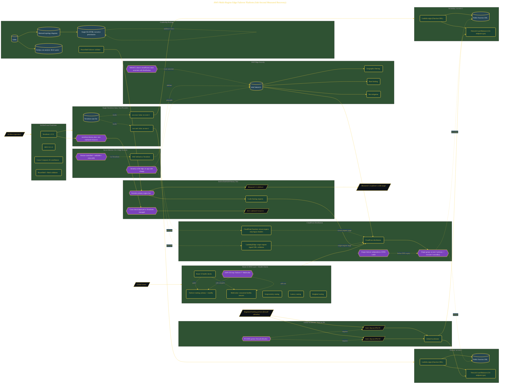

# AWS Multi-Region Edge Failover Sprint

> Inside the [Cloud Systems Engineering](../../README.md) portfolio · *Cloud platforms engineered for scale, reliability, and uptime.*

## Overview

This project focused on building a resilient multi-region edge architecture capable of maintaining service availability during regional failures. The environment was prepared by validating Terraform 1.15.3 and AWS CLI v2, establishing the project structure, initializing Terraform state, and coordinating work across AI-assisted contributors through Cursor Composer. These foundational steps ensured that deployment activities could proceed with a consistent and repeatable infrastructure workflow.

The objective was not only to deploy resources, but to prove operational recovery, infrastructure portability, and controlled failover through infrastructure as code. Establishing a clean deployment baseline reduced configuration drift risk and enabled reliable validation throughout the sprint.

The architecture is built across **7 phases**, anchored by **Architecting a Crisis Response: The $0.61 Sprint** on the input side and **WAF Edge Security Without Touching Application Code** at the end. Each phase is listed in the Implementation section below.

## Architecture

The diagram shows the topology and data flow of the system as built. The full architectural narrative, with screenshots and prose, lives in [`documents/aws-multi-region-edge-failover-platform.md`](./documents/aws-multi-region-edge-failover-platform.md).

## Implementation

This system is built across **7 phases**:

1. **Architecting a Crisis Response: The $0.61 Sprint**
2. **Building Two-Region Origins and Automated DNS Failover**
3. **Deploying CloudFront with Sub-5-Second Origin Failover and Edge Compute**
4. **Providing Static IPs for Regulated Banking Partners with Global Accelerator and WAF**
5. **Delivering the Leadership Package: ADRs, FinOps, and the Director Presentation**
6. **Proving Sub-60-Second Failover and Zero Orphaned Resources**
7. **WAF Edge Security Without Touching Application Code**

For the full walkthrough with screenshots and step-by-step content, see [`documents/aws-multi-region-edge-failover-platform.md`](./documents/aws-multi-region-edge-failover-platform.md).

## Validation

Each build phase below is documented in [`documents/aws-multi-region-edge-failover-platform.md`](./documents/aws-multi-region-edge-failover-platform.md), with screenshots, configuration, and notes as captured during the build:

- ✅ Architecting a Crisis Response: The $0.61 Sprint
- ✅ Building Two-Region Origins and Automated DNS Failover
- ✅ Deploying CloudFront with Sub-5-Second Origin Failover and Edge Compute
- ✅ Providing Static IPs for Regulated Banking Partners with Global Accelerator and WAF
- ✅ Delivering the Leadership Package: ADRs, FinOps, and the Director Presentation
- ✅ Proving Sub-60-Second Failover and Zero Orphaned Resources
- ✅ WAF Edge Security Without Touching Application Code
