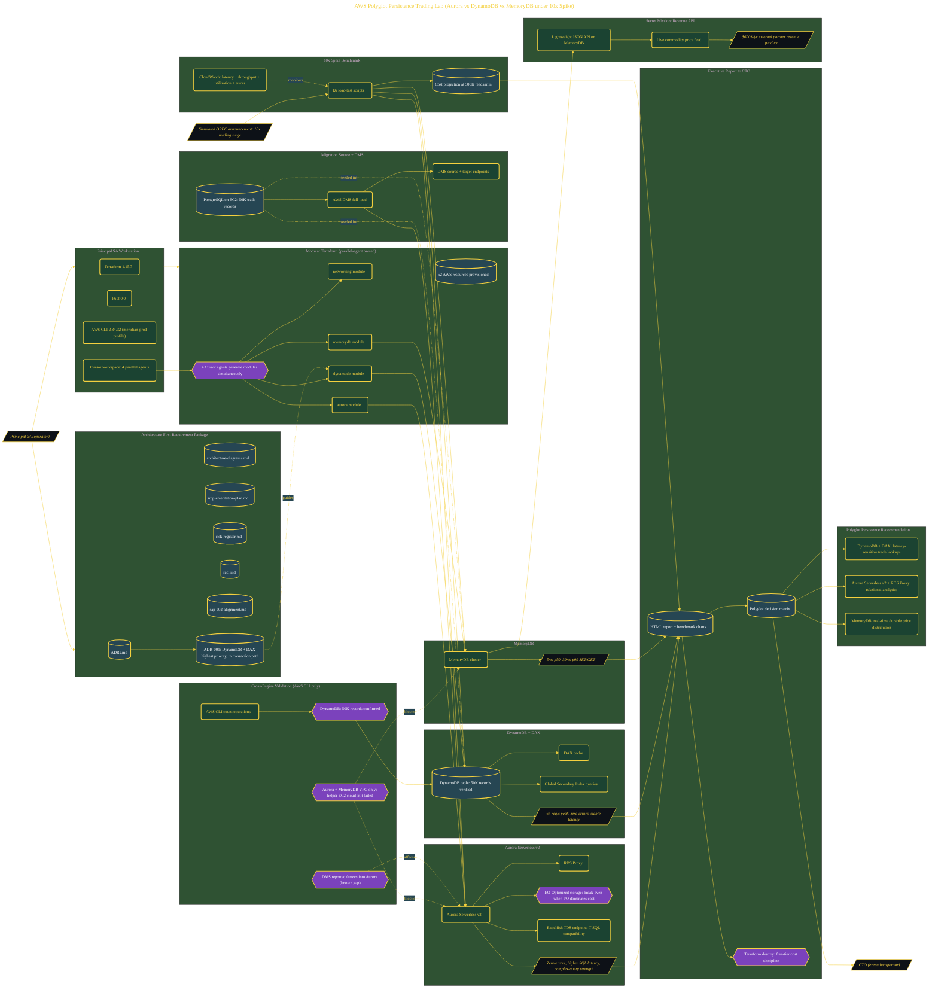

# AWS Database Modernization Lab

> Inside the [Cloud Systems Engineering](../../README.md) portfolio · *Cloud platforms engineered for scale, reliability, and uptime.*

## Overview

This lab evaluated modern AWS database services under a simulated tenfold increase in trading activity to determine the most appropriate architecture for different application workloads. The implementation compared Amazon Aurora Serverless v2, Amazon DynamoDB with DAX, and Amazon MemoryDB by migrating 50,000 trade records, executing k6 performance tests, and measuring latency, throughput, scalability, and operational cost. The objective was not to identify a single database for every workload, but to understand where each service delivered the greatest value while maintaining cost efficiency. The final deliverable was an executive HTML report recommending a modern AWS database architecture that raised application responsiveness, reduced operational overhead, and remained within AWS Free Tier limits throughout development.

The architecture is built across **9 phases**, anchored by **Taking On the Assignment: Day 1 at Meridian Energy Trading** on the input side and **Mission Accomplished: Lessons from the Lab** at the end. Each phase is listed in the Implementation section below.

## Architecture

The diagram shows the topology and data flow of the system as built. The full architectural narrative, with screenshots and prose, lives in [`documents/aws-polyglot-persistence-trading-lab.md`](./documents/aws-polyglot-persistence-trading-lab.md).

## Implementation

This system is built across **9 phases**:

1. **Taking On the Assignment: Day 1 at Meridian Energy Trading**
2. **Architecting the Solution: The Requirement Package**
3. **Setting Up the Principal SA Workstation**
4. **Deploying Three Database Engines with Parallel AI Agents**
5. **Migrating Data and Verifying All Three Engines**
6. **Simulating an OPEC Announcement: The 10x Spike Benchmark**
7. **Delivering the Executive Report to the CTO**
8. **I/O-Optimized, Babelfish, and the Revenue API**
9. **Mission Accomplished: Lessons from the Lab**

For the full walkthrough with screenshots and step-by-step content, see [`documents/aws-polyglot-persistence-trading-lab.md`](./documents/aws-polyglot-persistence-trading-lab.md).

## Validation

Build outcomes verified end-to-end. Each phase below is captured with screenshots, configuration, and observable behavior in [`documents/aws-polyglot-persistence-trading-lab.md`](./documents/aws-polyglot-persistence-trading-lab.md):

- ✅ Taking On the Assignment: Day 1 at Meridian Energy Trading
- ✅ Architecting the Solution: The Requirement Package
- ✅ Setting Up the Principal SA Workstation
- ✅ Deploying Three Database Engines with Parallel AI Agents
- ✅ Migrating Data and Verifying All Three Engines
- ✅ Simulating an OPEC Announcement: The 10x Spike Benchmark
- ✅ Delivering the Executive Report to the CTO
- ✅ I/O-Optimized, Babelfish, and the Revenue API
- ✅ Mission Accomplished: Lessons from the Lab
