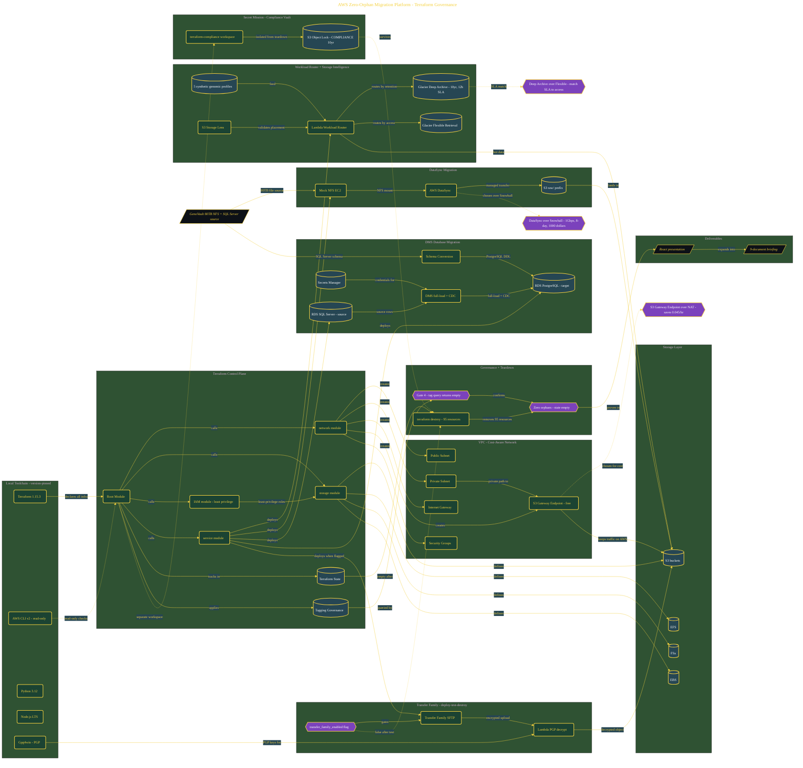

# AWS Principal SA: Fix the $2.1M Pipeline

> Inside the [Cloud Systems Engineering](../../README.md) portfolio · *Cloud platforms engineered for scale, reliability, and uptime.*

## Overview

In this build, I built a Terraform-managed AWS platform for GenoVault to address a $2.1M migration pipeline problem. The system was designed to remove orphan resources, enforce strict Infrastructure as Code governance, and show how migration pipelines can lower cost while still meeting migration and compliance needs.

The main decision was to make Terraform the control plane for the environment. Resources were not created through one-off manual actions. They were declared in code, tracked in state, tagged for visibility, and tied to a clean teardown path.

This mattered because migration environments can become expensive when resources stay alive after their purpose is complete. The build proved that cost control, governance, migration design, and teardown discipline had to work as one system.

The architecture is built across **9 phases**, anchored by **The $2.1M Problem: Why This Project Exists** on the input side and **NIH-Grade Compliance Vault with Object Lock** at the end. Each phase is listed in the Implementation section below.

## Architecture

The diagram shows the topology and data flow of the system as built. The full architectural narrative, with screenshots and prose, lives in [`documents/aws-zero-orphan-migration-platform.md`](./documents/aws-zero-orphan-migration-platform.md).

## Implementation

This system is built across **9 phases**:

1. **The $2.1M Problem: Why This Project Exists**
2. **Setting Up a Zero-Orphan Engineering Environment**
3. **Building the Network Foundation with Cost-Aware VPC Design**
4. **Deploying the Genomic Workload Router and Storage Intelligence Layer**
5. **Validating the DataSync NFS-to-S3 Migration Pipeline**
6. **Migrating SQL Server to PostgreSQL with DMS and Schema Conversion**
7. **Deploying and Destroying Transfer Family SFTP with PGP Decryption**
8. **Red-Team Validation, Lessons Learned Presentation, and Terraform Destroy**
9. **NIH-Grade Compliance Vault with Object Lock**

For the full walkthrough with screenshots and step-by-step content, see [`documents/aws-zero-orphan-migration-platform.md`](./documents/aws-zero-orphan-migration-platform.md).

## Validation

Each build phase below is documented in [`documents/aws-zero-orphan-migration-platform.md`](./documents/aws-zero-orphan-migration-platform.md), with screenshots, configuration, and notes as captured during the build:

- ✅ The $2.1M Problem: Why This Project Exists
- ✅ Setting Up a Zero-Orphan Engineering Environment
- ✅ Building the Network Foundation with Cost-Aware VPC Design
- ✅ Deploying the Genomic Workload Router and Storage Intelligence Layer
- ✅ Validating the DataSync NFS-to-S3 Migration Pipeline
- ✅ Migrating SQL Server to PostgreSQL with DMS and Schema Conversion
- ✅ Deploying and Destroying Transfer Family SFTP with PGP Decryption
- ✅ Red-Team Validation, Lessons Learned Presentation, and Terraform Destroy
- ✅ NIH-Grade Compliance Vault with Object Lock
