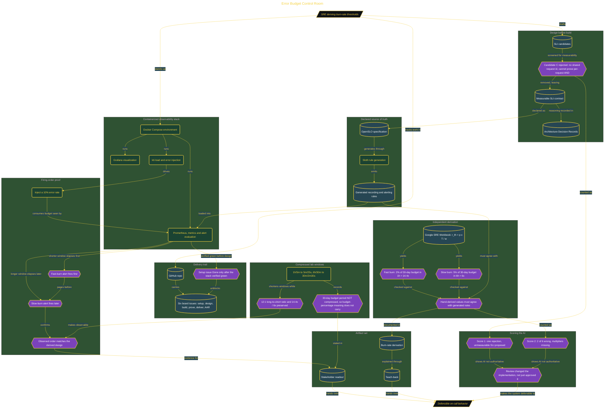

# Error Budget Control Room

> Inside the [Cloud Systems Engineering](../../README.md) portfolio · *Cloud platforms engineered for scale, reliability, and uptime.*

## Overview

I built the control room to derive and validate error-budget burn-rate thresholds instead of accepting generic alert values without understanding them.

The thresholds matter because bad alert design creates two opposite risks. Alerts that fire too often create noise and fatigue, while alerts that react too slowly can let meaningful SLO consumption continue without intervention.

Deriving the values manually gave me a way to connect the alert configuration back to the underlying SRE math. The result was a system where the on-call behavior could be traced to explicit assumptions about budget consumption, SLO period, and alert windows.

The architecture is built across **7 phases**, anchored by **Building an Error Budget Control Room from First Principles** on the input side and **Scoring the AI: After-Action Review** at the end. Each phase is listed in the Implementation section below.

## Architecture

The diagram shows the topology and data flow of the system as built. The full architectural narrative, with screenshots and prose, lives in [`documents/error-budget-control-room.md`](./documents/error-budget-control-room.md).

## Implementation

This system is built across **7 phases**:

1. **Building an Error Budget Control Room from First Principles**
2. **Proving the Stack is Green**
3. **Designing with AI: Arguing the Denominator**
4. **Generating and Verifying Burn-Rate Rules**
5. **Proving Firing Order: The Fast Burn Pages First**
6. **Deriving and Delivering the Full Artifact Set**
7. **Scoring the AI: After-Action Review**

For the full walkthrough with screenshots and step-by-step content, see [`documents/error-budget-control-room.md`](./documents/error-budget-control-room.md).

## Validation

Each build phase below is documented in [`documents/error-budget-control-room.md`](./documents/error-budget-control-room.md), with screenshots, configuration, and notes as captured during the build:

- ✅ Building an Error Budget Control Room from First Principles
- ✅ Proving the Stack is Green
- ✅ Designing with AI: Arguing the Denominator
- ✅ Generating and Verifying Burn-Rate Rules
- ✅ Proving Firing Order: The Fast Burn Pages First
- ✅ Deriving and Delivering the Full Artifact Set
- ✅ Scoring the AI: After-Action Review
