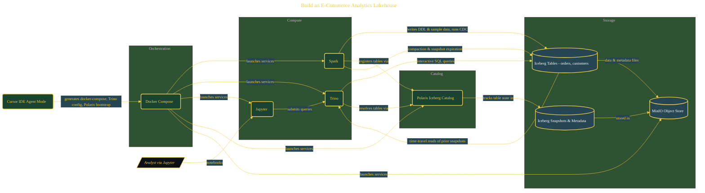

# Build an E-Commerce Analytics Lakehouse

> Inside the [Cloud Systems Engineering](../../README.md) portfolio · *Cloud platforms engineered for scale, reliability, and uptime.*

## Overview

-T-h-i-s- -p-r-o-j-e-c-t- -b-u-i-l-d-s- -a-n- -e---c-o-m-m-e-r-c-e- -a-n-a-l-y-t-i-c-s- -l-a-k-e-h-o-u-s-e- -u-s-i-n-g- -A-p-a-c-h-e- -I-c-e-b-e-r-g-,- -T-r-i-n-o-,- -S-p-a-r-k-,- -a-n-d- -P-o-l-a-r-i-s-.-
-
-T-h-e- -g-o-a-l- -i-s- -t-o- -c-r-e-a-t-e- -a- -s-y-s-t-e-m- -t-h-a-t- -s-u-p-p-o-r-t-s- -l-a-r-g-e---s-c-a-l-e- -d-a-t-a- -s-t-o-r-a-g-e-,- -r-e-a-l---t-i-m-e- -q-u-e-r-y-i-n-g-,- -a-n-d- -A-C-I-D---c-o-m-p-l-i-a-n-t- -u-p-d-a-t-e-s- -w-i-t-h-o-u-t- -r-e-l-y-i-n-g- -o-n- -p-r-o-p-r-i-e-t-a-r-y- -d-a-t-a- -w-a-r-e-h-o-u-s-e-s-.- -I-c-e-b-e-r-g- -p-r-o-v-i-d-e-s- -t-a-b-l-e---l-e-v-e-l- -v-e-r-s-i-o-n-i-n-g- -a-n-d- -s-c-h-e-m-a- -e-v-o-l-u-t-i-o-n-,- -w-h-i-l-e- -T-r-i-n-o- -e-n-a-b-l-e-s- -i-n-t-e-r-a-c-t-i-v-e- -q-u-e-r-i-e-s- -a-c-r-o-s-s- -t-h-e- -d-a-t-a-s-e-t-.- -T-h-i-s- -c-o-m-b-i-n-a-t-i-o-n- -a-l-l-o-w-s- -t-h-e- -s-y-s-t-e-m- -t-o- -b-e-h-a-v-e- -l-i-k-e- -a- -w-a-r-e-h-o-u-s-e- -w-h-i-l-e- -m-a-i-n-t-a-i-n-i-n-g- -t-h-e- -f-l-e-x-i-b-i-l-i-t-y- -o-f- -a- -d-a-t-a- -l-a-k-e-.-

The architecture is built across **9 phases**, anchored by **Configuring the Development Environment** on the input side and **Wrapping Up and Cleaning Down** at the end. Each phase is listed in the Implementation section below.

## Architecture

The diagram shows the topology and data flow of the system as built. The full architectural narrative, with screenshots and prose, lives in [`documents/lakehouse-iceberg-trino-spark.md`](./documents/lakehouse-iceberg-trino-spark.md).

## Implementation

This system is built across **9 phases**:

1. **Configuring the Development Environment**
2. **Scaffolding Infrastructure with Parallel Agents**
3. **Launching and Verifying the Lakehouse Stack**
4. **Designing the E-Commerce Data Model**
5. **Loading Data and Running Analytical Queries**
6. **Simulating Real-World Change Data Capture**, -.
7. **Running Compaction, Expiration, and Generating Reports**, -.
8. **Time-Travel Disaster Recovery**, -.
9. **Wrapping Up and Cleaning Down**

For the full walkthrough with screenshots and step-by-step content, see [`documents/lakehouse-iceberg-trino-spark.md`](./documents/lakehouse-iceberg-trino-spark.md).

## Validation

Build outcomes verified end-to-end. Each phase below is captured with screenshots, configuration, and observable behavior in [`documents/lakehouse-iceberg-trino-spark.md`](./documents/lakehouse-iceberg-trino-spark.md):

- ✅ Configuring the Development Environment
- ✅ Scaffolding Infrastructure with Parallel Agents
- ✅ Launching and Verifying the Lakehouse Stack
- ✅ Designing the E-Commerce Data Model
- ✅ Loading Data and Running Analytical Queries
- ✅ Simulating Real-World Change Data Capture
- ✅ Running Compaction, Expiration, and Generating Reports
- ✅ Time-Travel Disaster Recovery
- ✅ Wrapping Up and Cleaning Down
