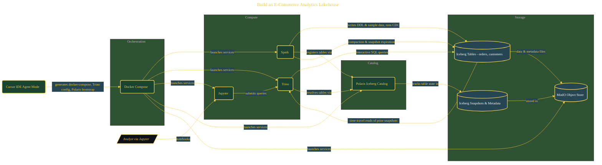

# Build an E-Commerce Analytics Lakehouse

> Inside the [Cloud Systems Engineering](../../README.md) portfolio · *Cloud platforms engineered for scale, reliability, and uptime.*

## Overview

This project builds an e-commerce analytics lakehouse using Apache Iceberg, Trino, Spark, and Polaris.

The goal is to create a system that supports large-scale data storage, real-time querying, and ACID-compliant updates without relying on proprietary data warehouses. Iceberg provides table-level versioning and schema evolution, while Trino enables interactive queries across the dataset. This combination allows the system to behave like a warehouse while maintaining the flexibility of a data lake.

The architecture is built across **9 phases**, anchored by **Configuring the Development Environment** on the input side and **Wrapping Up and Cleaning Down** at the end. Each phase is listed in the Implementation section below.

## Architecture

The diagram shows the topology and data flow of the system as built. The full architectural narrative, with screenshots and prose, lives in [`documents/lakehouse-iceberg-trino-spark.md`](./documents/lakehouse-iceberg-trino-spark.md).

## Implementation

This system is built across **9 phases**:

1. **Configuring the Development Environment**
2. **Scaffolding Infrastructure with Parallel Agents**
3. **Launching and Verifying the Lakehouse Stack**
4. **Designing the E-Commerce Data Model**
5. **Loading Data and Running Analytical Queries**
6. **Simulating Real-World Change Data Capture**
7. **Running Compaction, Expiration, and Generating Reports**
8. **Time-Travel Disaster Recovery**
9. **Wrapping Up and Cleaning Down**

For the full walkthrough with screenshots and step-by-step content, see [`documents/lakehouse-iceberg-trino-spark.md`](./documents/lakehouse-iceberg-trino-spark.md).

## Validation

Each build phase below is documented in [`documents/lakehouse-iceberg-trino-spark.md`](./documents/lakehouse-iceberg-trino-spark.md), with screenshots, configuration, and notes as captured during the build:

- ✅ Configuring the Development Environment
- ✅ Scaffolding Infrastructure with Parallel Agents
- ✅ Launching and Verifying the Lakehouse Stack
- ✅ Designing the E-Commerce Data Model
- ✅ Loading Data and Running Analytical Queries
- ✅ Simulating Real-World Change Data Capture
- ✅ Running Compaction, Expiration, and Generating Reports
- ✅ Time-Travel Disaster Recovery
- ✅ Wrapping Up and Cleaning Down
