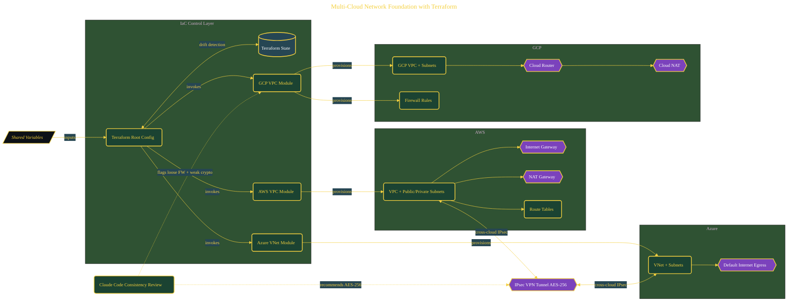

# Multi-Cloud Network Foundation with Terraform

> Inside the [Cloud Systems Engineering](../../README.md) portfolio · *Cloud platforms engineered for scale, reliability, and uptime.*

## Overview

-T-h-i-s- -p-r-o-j-e-c-t- -e-s-t-a-b-l-i-s-h-e-s- -a- -m-u-l-t-i---c-l-o-u-d- -n-e-t-w-o-r-k- -f-o-u-n-d-a-t-i-o-n- -u-s-i-n-g- -T-e-r-r-a-f-o-r-m-,- -d-e-s-i-g-n-e-d- -t-o- -s-t-a-n-d-a-r-d-i-z-e- -i-n-f-r-a-s-t-r-u-c-t-u-r-e- -p-a-t-t-e-r-n-s- -a-c-r-o-s-s- -A-W-S-,- -A-z-u-r-e-,- -a-n-d- -G-C-P-.-
-
-T-h-e- -g-o-a-l- -i-s- -n-o-t- -j-u-s-t- -p-r-o-v-i-s-i-o-n-i-n-g- -r-e-s-o-u-r-c-e-s-,- -b-u-t- -d-e-f-i-n-i-n-g- -a- -c-o-n-s-i-s-t-e-n-t- -i-n-t-e-r-f-a-c-e- -f-o-r- -n-e-t-w-o-r-k-i-n-g- -a-c-r-o-s-s- -p-r-o-v-i-d-e-r-s-.- -E-a-c-h- -c-l-o-u-d- -h-a-s- -d-i-f-f-e-r-e-n-t- -p-r-i-m-i-t-i-v-e-s-,- -s-o- -t-h-e- -a-r-c-h-i-t-e-c-t-u-r-e- -s-e-p-a-r-a-t-e-s- -p-r-o-v-i-d-e-r---s-p-e-c-i-f-i-c- -i-m-p-l-e-m-e-n-t-a-t-i-o-n- -i-n-t-o- -m-o-d-u-l-e-s- -w-h-i-l-e- -m-a-i-n-t-a-i-n-i-n-g- -a- -s-h-a-r-e-d- -s-t-r-u-c-t-u-r-e- -a-t- -t-h-e- -r-o-o-t- -l-e-v-e-l-.-

The architecture is built across **7 phases**, anchored by **The Multi-Cloud Vision** on the input side and **Cross-Cloud VPN Between AWS and Azure** at the end. Each phase is listed in the Implementation section below.

## Architecture

The diagram shows the topology and data flow of the system as built. The full architectural narrative, with screenshots and prose, lives in [`documents/multicloud-terraform-network-foundation.md`](./documents/multicloud-terraform-network-foundation.md).

## Implementation

This system is built across **7 phases**:

1. **The Multi-Cloud Vision**
2. **Setting Up the Multi-Cloud Toolkit**
3. **Scaffolding the Terraform Project**, -.
4. **Building the AWS VPC Module**
5. **Extending to Azure and GCP**
6. **Deploying Across Three Clouds and Validating with AI**
7. **Cross-Cloud VPN Between AWS and Azure**, -.

For the full walkthrough with screenshots and step-by-step content, see [`documents/multicloud-terraform-network-foundation.md`](./documents/multicloud-terraform-network-foundation.md).

## Validation

Build outcomes verified end-to-end. Each phase below is captured with screenshots, configuration, and observable behavior in [`documents/multicloud-terraform-network-foundation.md`](./documents/multicloud-terraform-network-foundation.md):

- ✅ The Multi-Cloud Vision
- ✅ Setting Up the Multi-Cloud Toolkit
- ✅ Scaffolding the Terraform Project
- ✅ Building the AWS VPC Module
- ✅ Extending to Azure and GCP
- ✅ Deploying Across Three Clouds and Validating with AI
- ✅ Cross-Cloud VPN Between AWS and Azure
