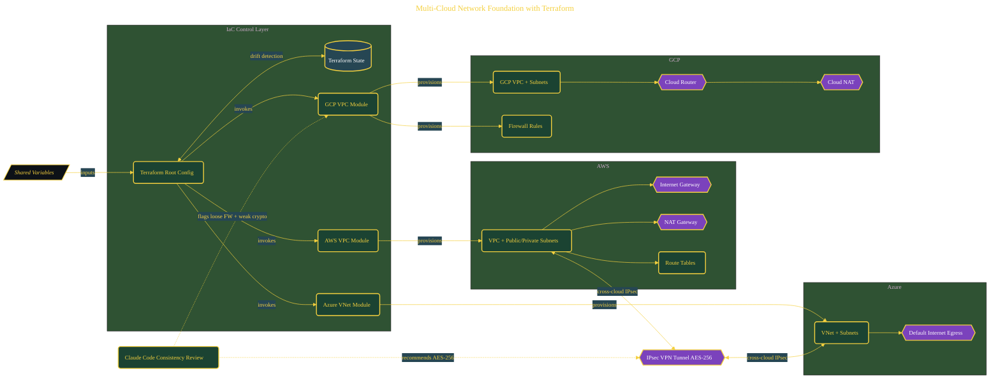

# Multi-Cloud Network Foundation with Terraform

> Inside the [Cloud Systems Engineering](../../README.md) portfolio · *Cloud platforms engineered for scale, reliability, and uptime.*

## Overview

This project establishes a multi-cloud network foundation using Terraform, designed to standardize infrastructure patterns across AWS, Azure, and GCP.

The goal is not just provisioning resources, but defining a consistent interface for networking across providers. Each cloud has different primitives, so the architecture separates provider-specific implementation into modules while maintaining a shared structure at the root level.

The architecture is built across **7 phases**, anchored by **The Multi-Cloud Vision** on the input side and **Cross-Cloud VPN Between AWS and Azure** at the end. Each phase is listed in the Implementation section below.

## Architecture

The diagram shows the topology and data flow of the system as built. The full architectural narrative, with screenshots and prose, lives in [`documents/multicloud-terraform-network-foundation.md`](./documents/multicloud-terraform-network-foundation.md).

## Implementation

This system is built across **7 phases**:

1. **The Multi-Cloud Vision**
2. **Setting Up the Multi-Cloud Toolkit**
3. **Scaffolding the Terraform Project**
4. **Building the AWS VPC Module**
5. **Extending to Azure and GCP**
6. **Deploying Across Three Clouds and Validating with AI**
7. **Cross-Cloud VPN Between AWS and Azure**

For the full walkthrough with screenshots and step-by-step content, see [`documents/multicloud-terraform-network-foundation.md`](./documents/multicloud-terraform-network-foundation.md).

## Validation

Each build phase below is documented in [`documents/multicloud-terraform-network-foundation.md`](./documents/multicloud-terraform-network-foundation.md), with screenshots, configuration, and notes as captured during the build:

- ✅ The Multi-Cloud Vision
- ✅ Setting Up the Multi-Cloud Toolkit
- ✅ Scaffolding the Terraform Project
- ✅ Building the AWS VPC Module
- ✅ Extending to Azure and GCP
- ✅ Deploying Across Three Clouds and Validating with AI
- ✅ Cross-Cloud VPN Between AWS and Azure
