# Build an Operable Service

> Inside the [Cloud Systems Engineering](../../README.md) portfolio · *Cloud platforms engineered for scale, reliability, and uptime.*

## Overview

I built a FastAPI service that runs through Docker Compose, connects to PostgreSQL, emits structured logs, and exposes health checks that separate process health from dependency readiness.

The goal was to prove operability, not just functionality. A service that can start is not enough. It also needs clear configuration boundaries, honest health signals, and trace evidence that explains what happened during each request.

This mattered because production services fail in ways that code alone does not explain. The build showed how to make the service easier to operate, debug, and trust.

The architecture is built across **7 phases**, anchored by **Building an Operable Inventory Service** on the input side and **Closing the Repo and Proving from a Clean Clone** at the end. Each phase is listed in the Implementation section below.

## Architecture

```mermaid
---
title: Operable Inventory Service
---
%%{init: {"theme":"base","themeVariables": {"primaryColor":"#1B4332","primaryTextColor":"#F4D03F","primaryBorderColor":"#F4D03F","secondaryColor":"#264653","tertiaryColor":"#2F5233","lineColor":"#F4D03F","fontFamily":"ui-monospace, SFMono-Regular, Menlo, Consolas, monospace","fontSize":"13px"}}}%%
flowchart TD
    classDef datastore fill:#264653,stroke:#F4D03F,stroke-width:2px,color:#FFFFFF
    classDef service fill:#1B4332,stroke:#F4D03F,stroke-width:2px,color:#F4D03F
    classDef event fill:#7B42BC,stroke:#F4D03F,stroke-width:2px,color:#FFFFFF
    classDef io fill:#0d1117,stroke:#F4D03F,stroke-width:1.5px,color:#F4D03F,font-style:italic

    Engineer[/Engineer proving operability, not just function/]
    Operable[/Service that can be operated, debugged, and trusted/]

    subgraph Design["Design before build"]
        MADR[(Three MADR decision records)]
        C4[(C4 container diagram)]
        ADRFix{{ADR corrected: SQLite fits a different write shape, not a Factor IV breach}}
        Reversal{{Reversal trigger made measurable: 2 failed runs or over 3 min waiting on PostgreSQL}}
    end

    subgraph Service["Inventory service"]
        FastAPI(FastAPI application)
        Compose(Docker Compose environment)
        Postgres[(PostgreSQL)]
    end

    subgraph Config["Twelve-Factor config"]
        EnvVars[(Environment variables)]
        DatabaseUrl(DATABASE_URL read from the environment)
        JsonLogs(Structured JSON logging as an event stream)
    end

    subgraph ConfigProof["Config proof"]
        BadHost(Point the host at does-not-exist)
        ResolveFail{{Fails to resolve host and exits, main.py untouched}}
        NoFallback{{Proves no hardcoded fallback hides in the code}}
    end

    subgraph Health["Honest health signals"]
        Liveness(/healthz/live, is the process alive)
        Readiness(readiness, can it serve traffic now)
        RestartStorm{{A single /health checking the database turns a blip into a restart storm}}
        SplitProbes{{Split probes: readiness drains at 503 while liveness holds 200}}
    end

    subgraph Tracing["Distributed tracing"]
        Otel(OpenTelemetry auto-instrumentation)
        Jaeger(Jaeger trace viewer)
        SpanChain{{Parent-child spans across HTTP, handler, and database}}
    end

    subgraph ProofRun["Full proof sequence"]
        KillDb(Take PostgreSQL down)
        LiveFast{{Liveness stays 200 under 200 ms with the database down}}
        ReadyDrain{{Readiness returns 503 while liveness stays 200}}
        SelfHeal{{Readiness heals on database return with no restart}}
    end

    subgraph Scoring["AI scoring, blocked honestly"]
        SealedKey[(.factor-key.sealed ground truth)]
        KeyMissing{{Sealed file missing, so the audit could not be scored}}
        RecordedMiss{{Recorded miss is that scoring never happened, no content-level miss claimed}}
    end

    subgraph Close["Clean-clone proof"]
        CleanClone(Clone and run from scratch)
        CloneTime{{1 min 9 sec, 21:08:17Z to 21:09:26Z}}
        Feasibility[(docs/feasibility.md: URL, wall clock, three proof results)]
        CacheNote{{Honesty note: Docker reused a local pip layer cache, so not a cold build}}
    end

    Engineer -- "records decisions in" --> MADR
    Engineer -- "models containers in" --> C4
    MADR -- "reviewed and corrected by" --> ADRFix
    ADRFix -- "tightened into" --> Reversal
    C4 -- "guides wiring of" --> FastAPI
    Compose -- "orchestrates" --> FastAPI
    Compose -- "orchestrates" --> Postgres
    FastAPI -- "reads settings from" --> EnvVars
    EnvVars -- "supplies" --> DatabaseUrl
    DatabaseUrl -- "connects to" --> Postgres
    FastAPI -- "emits" --> JsonLogs
    DatabaseUrl -- "tested by" --> BadHost
    BadHost -- "produces" --> ResolveFail
    ResolveFail -- "demonstrates" --> NoFallback
    FastAPI -- "exposes" --> Liveness
    FastAPI -- "exposes" --> Readiness
    Readiness -- "checks" --> Postgres
    RestartStorm -- "is the failure mode avoided by" --> SplitProbes
    Liveness -- "half of" --> SplitProbes
    Readiness -- "half of" --> SplitProbes
    Otel -- "instruments" --> FastAPI
    Otel -- "exports to" --> Jaeger
    Jaeger -- "shows" --> SpanChain
    KillDb -- "removes" --> Postgres
    KillDb -- "measured by" --> LiveFast
    KillDb -- "measured by" --> ReadyDrain
    ReadyDrain -- "followed by" --> SelfHeal
    SplitProbes -- "is what makes possible" --> SelfHeal
    SealedKey -- "was absent, giving" --> KeyMissing
    KeyMissing -- "reported as" --> RecordedMiss
    CleanClone -- "timed at" --> CloneTime
    CloneTime -- "recorded in" --> Feasibility
    SpanChain -- "recorded in" --> Feasibility
    LiveFast -- "recorded in" --> Feasibility
    CloneTime -- "qualified by" --> CacheNote
    NoFallback -- "contributes to" --> Operable
    SelfHeal -- "contributes to" --> Operable
    SpanChain -- "contributes to" --> Operable
    Feasibility -- "proves reproducibility for" --> Operable
    RecordedMiss -- "keeps the claim honest for" --> Operable

    class MADR,C4,EnvVars,Postgres,SealedKey,Feasibility datastore
    class FastAPI,Compose,DatabaseUrl,JsonLogs,BadHost,Liveness,Readiness,Otel,Jaeger,KillDb,CleanClone service
    class ADRFix,Reversal,ResolveFail,NoFallback,RestartStorm,SplitProbes,SpanChain,LiveFast,ReadyDrain,SelfHeal,KeyMissing,RecordedMiss,CloneTime,CacheNote event
    class Engineer,Operable io
```

The diagram shows the topology and data flow of the system as built. The full architectural narrative, with screenshots and prose, lives in [`documents/operable-inventory-service.md`](./documents/operable-inventory-service.md).

## Implementation

This system is built across **7 phases**:

1. **Building an Operable Inventory Service**
2. **Drafting and Correcting AI-Generated Design Records**
3. **Externalizing Config and Proving It Works**
4. **Implementing Honest Health Signals**
5. **Wiring Distributed Tracing with OpenTelemetry**
6. **Scoring the AI and Writing the Teach-Back**
7. **Closing the Repo and Proving from a Clean Clone**

For the full walkthrough with screenshots and step-by-step content, see [`documents/operable-inventory-service.md`](./documents/operable-inventory-service.md).

## Validation

Each build phase below is documented in [`documents/operable-inventory-service.md`](./documents/operable-inventory-service.md), with screenshots, configuration, and notes as captured during the build:

- ✅ Building an Operable Inventory Service
- ✅ Drafting and Correcting AI-Generated Design Records
- ✅ Externalizing Config and Proving It Works
- ✅ Implementing Honest Health Signals
- ✅ Wiring Distributed Tracing with OpenTelemetry
- ✅ Scoring the AI and Writing the Teach-Back
- ✅ Closing the Repo and Proving from a Clean Clone
