# Build a Workstation Readiness Doctor

> Inside the [Cloud Systems Engineering](../../README.md) portfolio · *Cloud platforms engineered for scale, reliability, and uptime.*

## Overview

I built and tested the workstation doctor on Windows using Cursor as the primary development environment. The implementation used Go to produce a compiled CLI that could inspect workstation capabilities without changing the installed tools. I treated Windows as the verified platform while keeping the check architecture suitable for later operating-system-specific implementations.

This work belonged in my portfolio because it demonstrated more than dependency installation. I defined readiness policy, encoded ten checks, enforced version requirements, added command timeouts, returned truthful process status, and documented the implementation through Git history and a merge-based pull request. The result showed how I approached developer enablement as an engineering control. I did not claim complete cross-platform support from one Windows run. That claim would require executing equivalent checks and failure cases on macOS and Linux.

The architecture is built across **7 phases**, anchored by **Establishing a Portfolio-Ready Workstation Plan** on the input side and **Proving Version Drift Is Caught Safely** at the end. Each phase is listed in the Implementation section below.

## Architecture

```mermaid
---
title: Build a Workstation Readiness Doctor
---
%%{init: {"theme":"base","themeVariables": {"primaryColor":"#1B4332","primaryTextColor":"#F4D03F","primaryBorderColor":"#F4D03F","secondaryColor":"#264653","tertiaryColor":"#2F5233","lineColor":"#F4D03F","fontFamily":"ui-monospace, SFMono-Regular, Menlo, Consolas, monospace","fontSize":"13px"}}}%%
flowchart TD
    classDef datastore fill:#264653,stroke:#F4D03F,stroke-width:2px,color:#FFFFFF
    classDef service fill:#1B4332,stroke:#F4D03F,stroke-width:2px,color:#F4D03F
    classDef event fill:#7B42BC,stroke:#F4D03F,stroke-width:2px,color:#FFFFFF
    classDef io fill:#0d1117,stroke:#F4D03F,stroke-width:1.5px,color:#F4D03F,font-style:italic

    Engineer[/Engineer standing up a workstation/]
    Automation[/Task, scripts and CI that must trust the exit status/]
    Reviewer[/Another engineer inspecting the handover without a live explanation/]

    subgraph DayZero["The contract, before any code"]
        Criteria[(Ten capabilities, version rules, timeout policy, required exit status)]
        NoSelfSet{{Written before the workstation state was known, so the doctor cannot set its own standard}}
        ReadOnly{{Observation separated from mutation: inspect, never install, upgrade or repair}}
        Reversible{{A failed check changes nothing, so early runs stay reversible}}
    end

    subgraph Provenance["Installer provenance"]
        Vendor(Installers fetched only from official vendor pages, remote scripts saved and read before running)
        NoPipe{{Nothing piped straight from download into a shell, because that removes the review point}}
        Sha[("SHA-256 compared against each vendor's published digest before install")]
        Zip[(Official ZIP archives used where installers needed unavailable admin rights, hashes still required)]
        Limit{{Proves file consistency with published digests, not that vendor software is free of defects}}
    end

    subgraph FirstCheck["One complete check as the pattern"]
        Shape[(Capability name, policy, invocation, parser, timeout behavior, visible result, process outcome)]
        Adr[(Architecture Decision Record with trade-offs and a reversal condition)]
        Trigger{{Each important decision carries the condition that would make it unsuitable}}
        Example{{Read-only diagnosis would be reconsidered only if users needed an approved repair mode with rollback}}
    end

    subgraph Table["Ten checks as data"]
        Entries[(Table entries: name, command or inspection, expected policy, result handler)]
        Loop(One shared loop applying timeout, formatting, evidence capture and aggregation)
        NoCopy{{Adding a capability is a new entry and a focused parser, not another command pipeline}}
        AllRun{{Every entry runs, so one early failure cannot hide the state of later tools}}
    end

    subgraph Hardening["Policy, deadlines, and a truthful exit"]
        Gate[(Version gates compare the observed major version to the approved one)]
        Presence{{Presence on PATH is not compliance}}
        Deadline[(Five-second deadline on every external command)]
        Summary[(Aggregate summary after all ten complete)]
        Exit{{Exit 0 only when every required check passes; non-zero on any failure or timeout}}
        TwoAudiences{{People read the evidence, automation reads the status, neither scrapes the other}}
    end

    subgraph Handover["Published as reviewable evidence"]
        Docs[(README, design records, usage, acceptance criteria, validation evidence, release notes)]
        History[(Merge-based pull request preserving each growth commit)]
        Closes[("Closes #1 ties the merge to its tracked issue")]
        Scope{{Tested on Windows; cross-platform is a design property awaiting macOS and Linux runs, and is stated as such}}
    end

    subgraph Drift["Pin drift, caught without touching the runtime"]
        Change(Only the expected Node.js major changed inside the doctor)
        Installed[(Node.js 24.21.0 stayed installed, on PATH, working)]
        Failed[(The next run failed: observed major no longer matched the policy)]
        Restored(Expected major set back to 24, workstation untouched throughout)
        Distinction{{Environment drift and policy drift are different things: the same machine can pass or fail on the declared requirement alone}}
        NotProven{{Proves the gate enforces policy, not that every version string or package layout parses}}
    end

    Engineer -- "writes" --> Criteria
    Criteria -- "fixed under" --> NoSelfSet
    Criteria -- "constrained by" --> ReadOnly
    ReadOnly -- "gives" --> Reversible
    Engineer -- "installs through" --> Vendor
    Vendor -- "held to" --> NoPipe
    Vendor -- "verified by" --> Sha
    Sha -- "also required for" --> Zip
    Sha -- "bounded by" --> Limit
    Criteria -- "realised first as" --> Shape
    Shape -- "recorded in" --> Adr
    Adr -- "carries" --> Trigger
    Trigger -- "for example" --> Example
    Shape -- "generalised into" --> Entries
    Entries -- "executed by" --> Loop
    Entries -- "means" --> NoCopy
    Loop -- "guarantees" --> AllRun
    Loop -- "applies" --> Gate
    Gate -- "establishes" --> Presence
    Loop -- "applies" --> Deadline
    Loop -- "produces" --> Summary
    Summary -- "decides" --> Exit
    Exit -- "serves" --> TwoAudiences
    Exit -- "consumed by" --> Automation
    Summary -- "read by" --> Engineer
    Loop -- "documented in" --> Docs
    Docs -- "shipped through" --> History
    History -- "closed by" --> Closes
    Docs -- "bounded by" --> Scope
    Docs -- "inspectable by" --> Reviewer
    Gate -- "tested by" --> Change
    Change -- "left alone" --> Installed
    Change -- "produced" --> Failed
    Failed -- "then" --> Restored
    Failed -- "beside a runtime that never changed shows" --> Distinction
    Distinction -- "bounded by" --> NotProven
    Failed -- "is the evidence handed to" --> Reviewer

    class Criteria,Sha,Zip,Shape,Adr,Entries,Gate,Deadline,Summary,Docs,History,Closes,Installed,Failed datastore
    class Vendor,Loop,Change,Restored service
    class NoSelfSet,ReadOnly,Reversible,NoPipe,Limit,Trigger,Example,NoCopy,AllRun,Presence,Exit,TwoAudiences,Scope,Distinction,NotProven event
    class Engineer,Automation,Reviewer io
```

The diagram shows the topology and data flow of the system as built. The full architectural narrative, with screenshots and prose, lives in [`documents/workstation-readiness-doctor.md`](./documents/workstation-readiness-doctor.md).

## Implementation

This system is built across **7 phases**:

1. **Establishing a Portfolio-Ready Workstation Plan**
2. **Preparing a Trusted Cross-Platform Toolchain**
3. **Designing the Doctor for Safe, Reversible Decisions**
4. **Scaling the Doctor into a Ten-Check Validation System**
5. **Hardening Automation with Timeouts and Reliable Failure Evidence**
6. **Publishing a Complete Engineering Handover**
7. **Proving Version Drift Is Caught Safely**

For the full walkthrough with screenshots and step-by-step content, see [`documents/workstation-readiness-doctor.md`](./documents/workstation-readiness-doctor.md).

## Validation

Each build phase below is documented in [`documents/workstation-readiness-doctor.md`](./documents/workstation-readiness-doctor.md), with screenshots, configuration, and notes as captured during the build:

- ✅ Establishing a Portfolio-Ready Workstation Plan
- ✅ Preparing a Trusted Cross-Platform Toolchain
- ✅ Designing the Doctor for Safe, Reversible Decisions
- ✅ Scaling the Doctor into a Ten-Check Validation System
- ✅ Hardening Automation with Timeouts and Reliable Failure Evidence
- ✅ Publishing a Complete Engineering Handover
- ✅ Proving Version Drift Is Caught Safely
