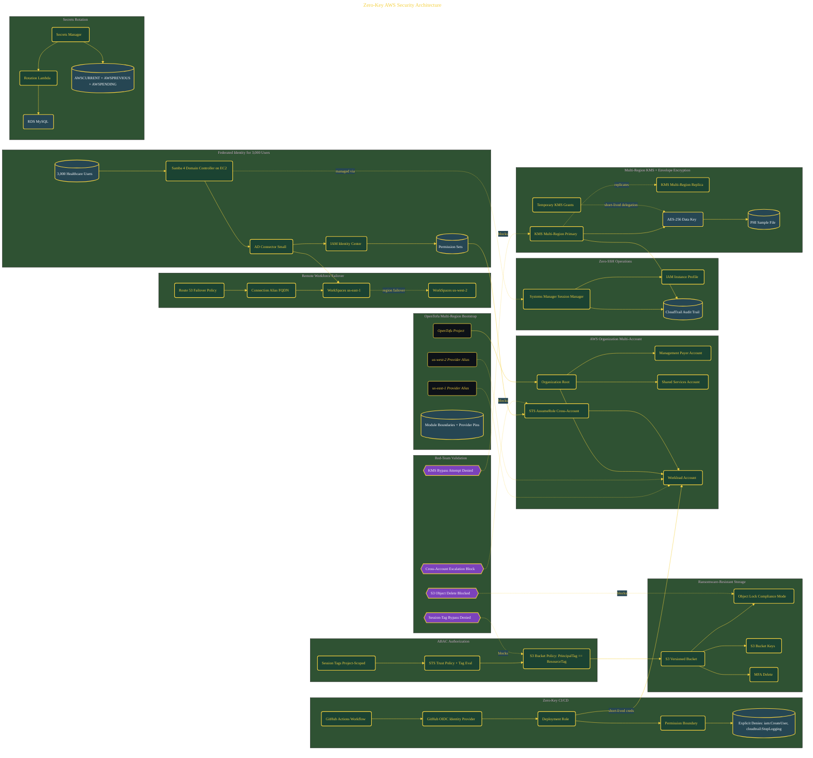

# Zero-Key AWS Security Architecture

> Inside the [Cloud Systems Engineering](../../README.md) portfolio · *Cloud platforms engineered for scale, reliability, and uptime.*

## Overview

In this project, I designed and validated a zero-trust AWS security architecture for a healthcare environment supporting approximately 3,000 federated users. The objective was to eliminate long-lived credentials and replace them with short-lived, auditable identity workflows built around federation, temporary access, encryption governance, and centralized access control.

The environment combined AWS Organizations, IAM Identity Center, GitHub OIDC federation, multi-region KMS, Secrets Manager rotation, WorkSpaces failover architecture, and ABAC authorization into a unified security model. Instead of relying on static IAM users, SSH keys, or manually distributed credentials, the architecture enforced temporary, policy-driven access where trust is continuously validated.

This project simulated an enterprise healthcare security modernization effort where identity, encryption, auditability, and governance are treated as foundational infrastructure.

The architecture is built across **13 phases**, anchored by **Building a Zero-Trust Security Architecture for Healthcare** on the input side and **Red-Teaming the Architecture: Four Attacks, Four Blocks** at the end. Each phase is listed in the Implementation section below.

## Architecture

The diagram shows the topology and data flow of the system as built. The full architectural narrative, with screenshots and prose, lives in [`documents/zero-key-aws-security-architecture.md`](./documents/zero-key-aws-security-architecture.md).

## Implementation

This system is built across **13 phases**:

1. **Building a Zero-Trust Security Architecture for Healthcare**
2. **Scaffolding the Multi-Account Infrastructure**
3. **Establishing AWS Organizations and Cross-Account Trust**
4. **Deploying a Zero-SSH Active Directory Domain Controller**
5. **Federating 3,000 Users Through AD Connector and Identity Center**
6. **Achieving Zero-Key CI/CD with GitHub OIDC and Permission Boundaries**
7. **Enforcing ABAC Isolation Across Projects Without Policy Rewrites**
8. **Implementing Multi-Region KMS Keys and Envelope Encryption**
9. **Exposing the Parameter Store Trap and Automating Secrets Rotation**
10. **Proving Ransomware Resistance with S3 Object Lock**
11. **Deploying WorkSpaces with Cross-Region Failover Architecture**
12. **Presenting the Architecture to Leadership**
13. **Red-Teaming the Architecture: Four Attacks, Four Blocks**

For the full walkthrough with screenshots and step-by-step content, see [`documents/zero-key-aws-security-architecture.md`](./documents/zero-key-aws-security-architecture.md).

## Validation

Build outcomes verified end-to-end. Each phase below is captured with screenshots, configuration, and observable behavior in [`documents/zero-key-aws-security-architecture.md`](./documents/zero-key-aws-security-architecture.md):

- ✅ Building a Zero-Trust Security Architecture for Healthcare
- ✅ Scaffolding the Multi-Account Infrastructure
- ✅ Establishing AWS Organizations and Cross-Account Trust
- ✅ Deploying a Zero-SSH Active Directory Domain Controller
- ✅ Federating 3,000 Users Through AD Connector and Identity Center
- ✅ Achieving Zero-Key CI/CD with GitHub OIDC and Permission Boundaries
- ✅ Enforcing ABAC Isolation Across Projects Without Policy Rewrites
- ✅ Implementing Multi-Region KMS Keys and Envelope Encryption
- ✅ Exposing the Parameter Store Trap and Automating Secrets Rotation
- ✅ Proving Ransomware Resistance with S3 Object Lock
- ✅ Deploying WorkSpaces with Cross-Region Failover Architecture
- ✅ Presenting the Architecture to Leadership
- ✅ Red-Teaming the Architecture: Four Attacks, Four Blocks
